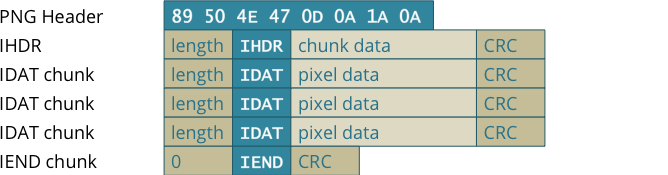

# Sasuga 

## Question Text

We need to recover this picture of the Supreme One!

*Creator - PotatoDrug*

## Distribution
- Sasuga
    - SHA1: `514e2ba0bdfca850eb00beea0e6b06a0fc94c029`
    - Corrupted png file

## Solution
The given png file has the following errors.

1. Invalid file header
2. IDAT chunk header changed to lDAT
3. Invalid chunk length for all IDAT chunks
4. Invalid CRC for all IDAT chunks

Below is the sample structure of a simple png file.

The first 2 errors are rather easy to fix, just a simple search and replace.

To fix the other 2 errors you have to calculate the correct length and CRC value for each IDAT chunk.

[Sample Solution](solution/solve.py)

### Flag
`GCTF{S4Sug4_41N2_s4M4}`

## Recommended Reads
* http://www.libpng.org/pub/png/spec/1.2/PNG-Structure.html 