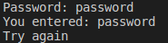
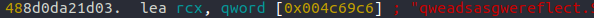

# Let's Go

## Question Text

We seem to have found a leaked executable from a system login program.
Has the developer left a standard password? 
Lets Go find the password!


`nc rev.chal.gryphonctf.com 18502`

*Creator - lohkaimun99*

### Hints (Optional)
1. salty salty md5

## Setup Guide
1. Distribute Lets-Go

## Distribution
- Let's Go
    - SHA1: `6b2cc35093ae3ae2e4005e5b0544fb192fa6621a`
    - 64 Bit ELF

## Solution
The program will ask for the password, which it will compute the some of the salt with md5.



NOTE: There is a suspicious link.


We will look at the main function:



Finally, the check function which has a special location (main.statictmp_0):


Lastly using the details found in the link to generate the password list:
```
https://github.com/Mebus/cupp
```
(Recommended by PotatoDrug)

We can see that there is a salt and a hash.
Then we proceed to using hashcat to crack the password: 
```.\hashcat64.exe -a 3 -m 20 .\<hash:salt list> <word_list>```

#### In the event pastebin post gets taken down:
```
Name: YuanKai Lam
DOB: 01 April 2000
Class: DISM/34
Age: 18
Nickname: KaiKai
 
Crush: Apple Lim
DOB: 04 April 2000
Nickname: XiaoPingGuo
 
Pet: Jonathan Lam
```

Password: kaikai10004

### Flag
`GCTF{L3ts_G0_H4v3_fun}`
