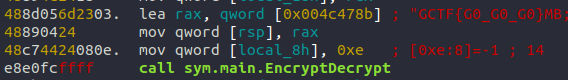

# Let's Go

## Question Text

Lets Go

`nc rev.chal.gryphonctf.com 80`

*Creator - lohkaimun99*

### Hints (Optional)
1. The program is written in Go

## Setup Guide
1. Run `./build.sh`

## Distribution
- Let's Go
    - SHA1: `1fe33c171d05763b68b52ddf4dd8f6fc13ae3b46`
    - 64 Bit ELF

## Solution

When accessed, the program ask the user to type in a key. (If the key is shorter than the FLAG it loops through)
```
Hello give me your key: <key>
You entered: <key>
This is the output: <output>
```

We will look at the main function:


We can see that the function sym.main.EncryptDecrypt is called
(code from: https://github.com/KyleBanks/XOREncryption/blob/master/Go/xor.go)

Then by reversing the function, it might be too difficult to see the XOR operations. 
However, the name EncryptDecrypt at the same function is a clue.

Solution: run solution.go


### Flag
`GCTF{G0_G0_G0}`
