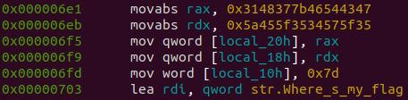

# What's This

## Question Text

My flag's gotta be somewhere here.

*Creator - Noans*

## Distribution
- WhatsThis
    - SHA1: `da744a4fe5d9ad3662a95715433a5205f96fabbb`
    - A program written in C

## Solution
Running the program, we see that the program merely print's `Where's my flag?!!?`.

Disassembling the program, we see the following



In the following links, we see that a local variable is being initialized with values. 

```asm
0x000006e1      48b847435446.  movabs rax, 0x3148377b46544347
0x000006eb      48ba355f5734.  movabs rdx, 0x5a455f3534575f35
0x000006f5      488945e0       mov qword [local_20h], rax
0x000006f9      488955e8       mov qword [local_18h], rdx
0x000006fd      66c745f07d00   mov word [local_10h], 0x7d  ; '}'
```

Copying the values `0x7d`, `0x5a455f3534575f35` and `0x3148377b46544347`, and coverting them into ASCII characters, we see that it yields `}ZE_54W_51H7{FTCG`.

Taking note the flag is stored in little-endian, flipping it `}ZE_54W_51H7{FTCG` yields the flag.

### Flag
`GCTF{7H15_W45_EZ}`
