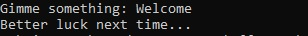
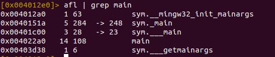
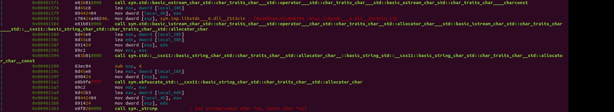
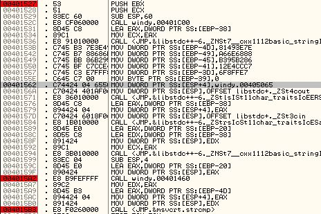
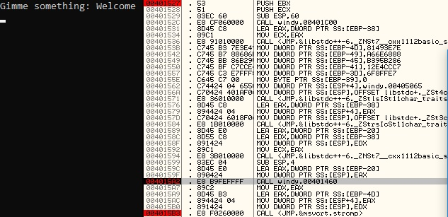
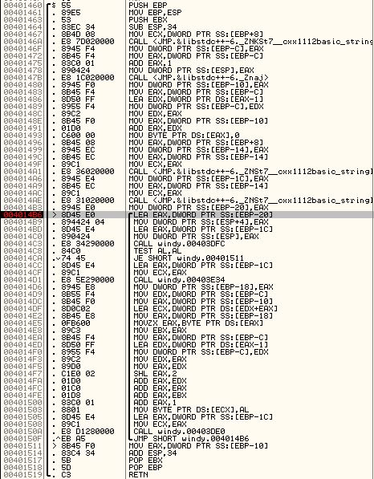
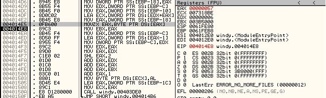
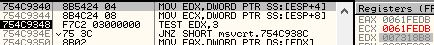

# Windy

## Question Text

It's a Windows executable. And it's not fun.

*Creator - Noans*

## Setup Guide
1. Compile the C++ source code with MingW compiler on Windows.
2. DO NOT RECOMPILE THE PROGRAM, THE HASH WILL CHANGE.

## Distribution
- windy.exe
    - SHA1: `e7c58106c927d161e76c9da0b0e43496563a6e6c`

## Solution
Running the program for the first time, we will see that it is a pretty simple application. It receives an input and gives a message based on the input it received.



That doesn't really help us, so let's open the program on a Linux machine with Radare2 to see what's happening. Doing a function list with grep, we see that there are a couple of functions with `main` in its name.



Fiddling around with the functions, we will eventually come to the actual `main` function of the program, which is `sym._main`. In `sym._main`, we have a couple of interesting stuff going on. We know, from running the program that the program prints "Gimme something:" and waits for a user input. Though beyond that, we have yet to figure out the inner workings of the program. However, with Radare2, we can see that after receiving user input, it calls a function called `obfuscate` before calling `strcmp`, likely on the results of obfuscate, with a string.



Now that we roughly know what's happening, let's open the program on Windows with a debugger (we're using OllDbg, recommendation courtesy of lohkaimun99). Starting off, let's set a few breakpoints. One at the start of the main method, at address `0x00401527`, one before the call to the obfuscate method at address `0x004015a2` and one before the call to `strcmp`, at address `0x4015a2`. This helps us figure out what the program is doing.



Next, let's run our program until it breaks at the obfuscate method (address: `0x004015a2`). We gave `Welcome` as input to our program.



Stepping into the obfuscate method, we see that there appears to be a looping structure, likely the bulk of the obfuscation function. So let's set a breakpoint at the start of the looping area, and try to manually run through it to see what's happening.



Stepping through it, eventually we reach this point where we see the program load the first letter of our input `Welcome` into register `eax`. So it seems to be starting to do something with our input. In the next few lines, the program appears to move the character `W` into register `ebx`, and also loading a number of value `6` from the stack at address `ebp - 0xc` to the register `eax` and using that number to do a couple of operations such as doing a logical left and some addition, before finally adding `ebx` (containing the first letter `W`) and putting it in a memory location at `0x007318BE` (program also decrements the number previously loaded from the stack in `eax` and places it back to the stack). From here, we can guess that the obfuscation function processes each character in our input, does something to obfuscate them and puts them in memory at (`0x007318B8` - `0x007318BF`). While doing so, it also places the character it processes from front to back in the memory location. So a letter starting with `W` is processed, and loaded into the location (`0x007318B8` - `0x007318BF`) starting from `0x007318BE` - `0x007318B8`. Setting a break point at `0x401519`, let's see what happens to our string when the obfuscate function ends.  
PS. `0x007318BF` is a null byte denoting end of strings.



Finally, our input becomes the following. We also are able to see some patterns.
```
W (0x57) => 0x94 => +61
e (0x65) => 0x98 => +51
l (0x6c) => 0x95 => +41
c (0x63) => 0x82 => +31
o (0x6f) => 0x84 => +21
m (0x6d) => 0x78 => +11
e (0x65) => 0x66 => +1
```
Loaded into memory

0x007318B8|0x007318B9|0x007318BA|0x007318BB|0x007318BC|0x007318BD|0x007318BE|0x007318BF
---|---|---|---|---|---|---|---
0x66|0x78|0x84|0x82|0x95|0x98|0x94|0x00

From here, let's try to find out what string our input is compared to. Jumping into the `strcmp` method, we see that our obfuscated `Welcome` string's address is loaded into register `edx`, while another string's address is loaded into register `ecx`.



Looking at the contents of memory at `0x0061fedb`, we see that a string.

0061FEDB | 7E 3E 49 81 88 68 6E A6 86 B2 95 B3 C7 CC E4 12 | ~>Iˆhn¦†²•³ÇÌä
0061FEEB | E7 FF F8 06 00                                  | çÿø.

Let's try to de-obfuscate this with what we know. We need to flip the contents and deduct (1 + i * 10) as we iterate up the characters. Use [https://www.calculator.net/hex-calculator.html](Hex Calculator)
```
0x06 - 191 => 0x47
0xf8 - 181 => 0x43
0xff - 171 => 0x54
0xe7 - 161 => 0x46
0x12 - 151 => 0x7b
0xe4 - 141 => 0x57
0xcc - 131 => 0x49
0xc7 - 121 => 0x4e
0xb3 - 111 => 0x44
0x95 - 101 => 0x30
0xb2 - 91 => 0x57
0x86 - 81 => 0x35
0xa6 - 71 => 0x5f
0x6e - 61 => 0x31
0x68 - 51 => 0x35
0x88 - 41 => 0x5f
0x81 - 31 => 0x62
0x49 - 21 => 0x34
0x3e - 11 => 0x33
0x7e - 1 => 0x7d
```

This, coverted from Hex to ASCII, yields the flag, `GCTF{WIND0W5_15_b43}`.

### Flag
`GCTF{WIND0W5_15_b43}`